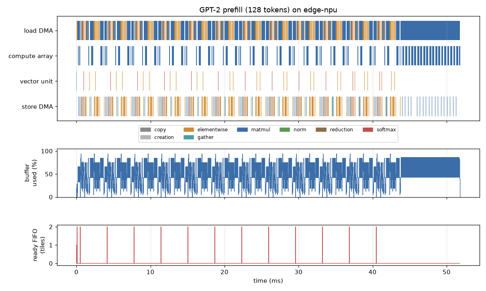
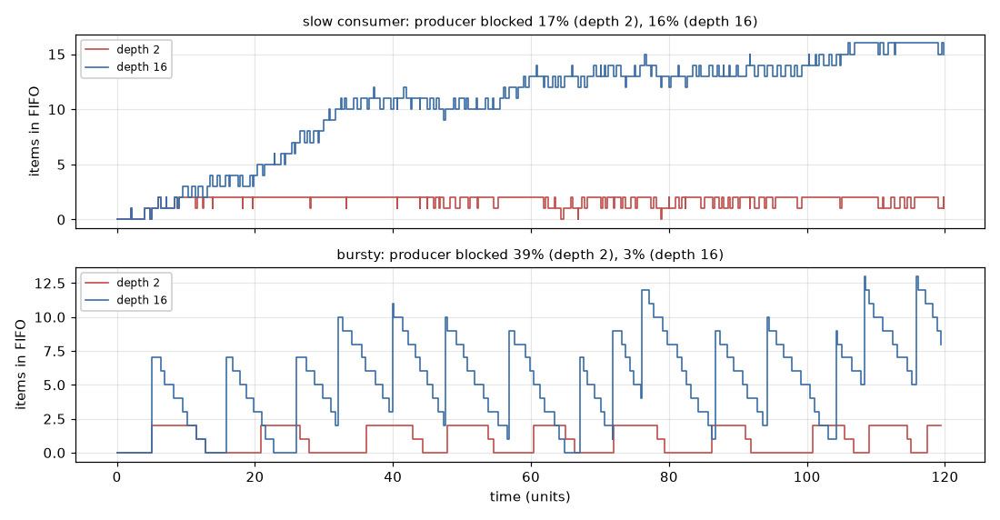
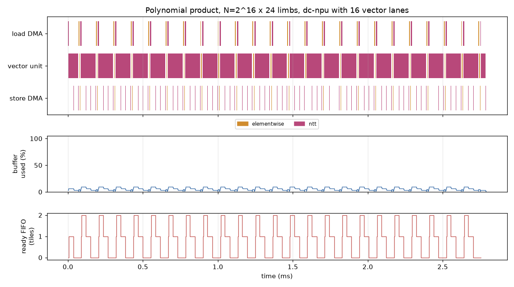

# Torch_Sim_Frontend

**`simfront`: a working front end from PyTorch and ONNX to an accelerator cost model.**
It turns a model into an operator trace four ways, costs the trace on a pluggable
accelerator model, and reports operator coverage as an engineering metric. It runs on
real published model configurations (Llama-3-8B and -70B, Mistral-7B, Qwen2.5-0.5B,
GPT-2) **without downloading or allocating a single weight**, on a CPU-only machine.

It also runs the trace **end to end through an event-driven SimPy model of an accelerator**
([`simfront.accel`](#the-accelerator-model-simfrontaccel)): off-chip memory with bandwidth limits,
an interconnect, load and store DMA engines, an on-chip buffer with back-pressure, a compute array
and a vector unit. It reports latency, utilisation per component, where the stalls are, the
hot-spot, and a timeline plot. The same model has a C++20 fast path (pybind11, bit-identical), a
cycle-stepped twin (identical cycle for cycle), an FHE-style NTT workload, and a miniature of how
an ONNX Runtime execution provider takes part of a graph.

It is the companion code for decks 10 (from PyTorch and ONNX to an accelerator model) and
[14](https://brendanjameslynskey.github.io/SimEng_14_Accelerator_Model_in_SimPy/) (an accelerator model in SimPy, end to end) of the
[Simulation Engineering Toolkit](https://github.com/BrendanJamesLynskey/SimEng_Hub_Toolkit)
series, and it starts from the roofline of
[Disaggregated_Inference_Sim](https://github.com/BrendanJamesLynskey/Disaggregated_Inference_Sim)
(LLM Inference Simulators).

| Front end | How | What it sees |
|---|---|---|
| **Dispatch trace** | A `TorchDispatchMode` records every ATen call, on the meta device or under fake CPU tensors | What PyTorch would execute on that device, call by call |
| **`torch.export`** | Export, `run_decompositions()` to Core ATen, walk the FX graph | One whole-program graph in a small operator set |
| **`torch.compile` backend** | A Dynamo backend that lowers each graph with AOTAutograd, costs it, then runs it | The graphs a user's unchanged program produces, graph breaks included |
| **ONNX** | Export without weights, `infer_shapes(data_prop=True)`, walk the graph | The framework-neutral route; folds constant subgraphs as a runtime would |

All four produce the same trace format (`simfront-trace/1`), with every tensor's shape,
element size and identity, and weights told apart from activations. That is what makes
them comparable, and what lets a cost model follow data between devices.

**Why trust it.** All numbers below come from [`examples/results.md`](examples/results.md).

* **The four front ends agree exactly.** On Llama-3-8B (2,048-token prefill, meta
  device) all four count 32,938,104,455,168 matmul FLOPs. ONNX is lower by exactly
  262,144: it constant-folds the rotary-frequency matmul. All four count
  15,026,626,560 bytes of weights read.
* **The trace equals the closed form.** The weight matmuls equal Disaggregated_Inference_Sim's
  2 × parameters × tokens exactly. A Hypothesis property test checks the same identity for
  random Llama-shaped configurations, batch sizes and lengths.
* **It matches PyTorch's own counter.** On the meta trace, `torch.utils.flop_counter.FlopCounterMode`
  gives the same total exactly.
* **It checks the tests themselves.** Fake tensors trace exactly what real tensors run,
  operator by operator, on a model without data-dependent Python. ONNX Runtime runs the
  exported model and matches PyTorch to 1e-4.

---

## Quick start

```bash
python -m venv .venv && source .venv/bin/activate
pip install torch --index-url https://download.pytorch.org/whl/cpu    # CPU-only is enough
pip install -e ".[test]"
pytest -p no:logging                                    # 145 tests, about a minute
simfront --model llama3-70b --tokens 2048               # 70B parameters, no memory used
simfront --model llama3-8b --decode 2048 --fake-cpu     # one decode step, fused attention
simfront --model llama3-8b --offload optical            # a matmul-only engine plus a host
python examples/results.py                              # regenerates examples/results.md
simfront-accel --model tiny-cnn --timeline cnn.png      # a CNN through the SimPy accelerator
simfront-accel --model gpt2 --tokens 128 --engine fast  # GPT-2 on the C++ fast path
python examples/accel_results.py                        # regenerates examples/accel_results.md
```

`pip install -e .` compiles the C++ fast path with pybind11 when a C++20 compiler is present
(GCC 10 or later); without one the install still succeeds and the Python recurrence is used.

```python
from simfront import device, models
from simfront.capture import trace_dispatch

m = models.build("llama3-8b")                             # meta device: shapes, no storage
trace, _ = trace_dispatch(m, models.tokens(1, 2048))
print(len(trace.ops), trace.flops, trace.weight_bytes)    # 3557 operators
report = device("h100").run(trace)                        # per-operator roofline
print(report.time, report.bound_split())
```

## Selected results

**Real models, no weights** (§2). The capture time is for a 2,048-token prefill on this
machine's CPU:

| Model | Parameters | Operators | Capture (s) |
|---|---|---|---|
| Llama-3-8B | 8.03 B | 3,557 | 0.64 |
| Llama-3-70B | 70.55 B | 8,837 | 1.23 |
| Mistral-7B | 7.24 B | 3,685 | 0.66 |

**Checking the closed form found two errors in it, since fixed** (§4). Disaggregated_Inference_Sim's
decode step charged the whole embedding table (1.05 GB, 6.4% of a Llama-3-8B decode
step's bytes) on every token, where a lookup reads one row. Its decode FLOPs also left out
the new token attending to itself (524,288 FLOPs). Neither is large, and both are the
kind of thing only an independent count finds. Both were corrected in
Disaggregated_Inference_Sim (and its JavaScript and Rust ports) on 2026-10-03. The closed form
and the trace now agree exactly, apart from two small terms the closed form does not model: the
rotary-frequency matmul (128 FLOPs) and the RMSNorm weights (532,480 bytes). The tests that
reported the discrepancy now check this agreement. The corrected decode step (5.70 ms at
context 2,048) equals the trace's ideal-fusion bound.

**What the trace shows depends on how it was captured** (§3, §5):

* On the **meta device**, attention has no fused kernel and decomposes into `bmm`,
  `_safe_softmax` and a mask over the full 2,048 × 2,048 score matrix per head. On the
  H100 roofline that prefill takes 126.68 ms, with only 44.6% of its time in
  compute-bound operators.
* Under **fake CPU tensors**, attention is one fused flash-attention operator per layer,
  and the same prefill takes 76.14 ms. The ideal-fusion bound is 60.62 ms; the closed
  form gives 58.53 ms.
* In **decode**, the meta trace moves 25.02 GB per step against 15.84 GB for the fused
  trace. 4.30 GB of the difference is transformers' `repeat_kv` materialising 8 KV
  heads as 32.
* **transformers itself changes path when it detects tracing.** In eager mode on real
  data it inspects the mask with `.item()` and uses SDPA's native GQA. When it detects
  tracing it builds an explicit mask and repeats the KV heads. The arithmetic is the
  same; the memory traffic is not. A test pins this down.

**Operator coverage is a time metric, not a count** (§6). Take a hypothetical matmul engine
(Disaggregated_Inference_Sim's optical part) attached to a host CPU over PCIe Gen5:

| Engine runs | FLOPs on the engine | Time on the engine | Prefill (ms) |
|---|---|---|---|
| matmul | 93.25% | 1.3% | 1,514.34 |
| + attention | 99.98% | 4.8% | 426.93 |
| + elementwise | 100.00% | 10.9% | 288.57 |
| everything | 100.00% | 100.0% | 36.16 |

In decode, adding attention without the KV-cache append (`cat`) makes the step *slower*
(16.59 → 19.86 ms), because the cache then crosses the link twice per step.

**PyTorch's FLOP counter misses fused CPU attention** (§7). `FlopCounterMode` has no
formula for `_scaled_dot_product_flash_attention_for_cpu`, so on the fused trace it
silently omits 2.22 TFLOP. simfront's coverage report names every operator without a
cost rule rather than costing it at zero. On its first run it named two missing rules
for GPT-2's ONNX export (`SplitToSequence`, `SequenceAt`), which were then added.

## How it works

| File | What |
|------|------|
| [`trace.py`](src/simfront/trace.py) | `TensorMeta`, `Op`, `Trace`: the format every front end produces, with JSON I/O |
| [`rules.py`](src/simfront/rules.py) | FLOPs and bytes per operator, for ATen and ONNX, by category (matmul, attention, elementwise, softmax, copy, view, ...) |
| [`capture/dispatch.py`](src/simfront/capture/dispatch.py) | `OpTrace`, a `TorchDispatchMode` that follows tensor identity and propagates "is a weight" through views |
| [`capture/export.py`](src/simfront/capture/export.py), [`compile.py`](src/simfront/capture/compile.py), [`fx_walk.py`](src/simfront/capture/fx_walk.py) | `torch.export` and the `SimBackend` for `torch.compile`, sharing one FX-graph walker |
| [`capture/onnx_walk.py`](src/simfront/capture/onnx_walk.py) | Weightless ONNX export; graph walk with data-propagating shape inference and constant folding |
| [`models.py`](src/simfront/models.py) | Published configurations (in `configs/`, each with its source URL); meta-device and fake-CPU builds; the link to InfSim's `ModelSpec` |
| [`cost.py`](src/simfront/cost.py) | `Roofline` (unfused and ideal-fusion bounds) and `Offload` (an accelerator for some categories, a host, a link) |
| [`coverage.py`](src/simfront/coverage.py) | Cost-rule coverage and device coverage (by operators, FLOPs and time), as a Markdown report |
| [`accel/`](src/simfront/accel) | The SimPy accelerator model: `hw.py` (configuration, timing), `lower.py` (trace to tiles), `sim.py` (SimPy engine), `metrics.py` (utilisation, stalls, hot-spot), `plot.py` (timeline PNG, Chrome trace), `fastpath.py` + `_fastpath.cpp` (recurrence, C++ via pybind11), `cycle.py` (cycle-stepped twin), `fifo.py`, `ntt.py`, `ep.py`, `cli.py` (`simfront-accel`) |

**Counting conventions, stated so they can be argued with.**

* Attention FLOPs are counted *unmasked*. A causal kernel that skips masked blocks does
  about half.
* Every non-view operator reads its inputs from memory and writes its outputs (the
  unfused bound). `memory="fused"` gives the opposite bound, where only matmul,
  attention and gather operators touch memory.
* Elementwise operations count one FLOP per output element; softmax and norms count five.
* An embedding lookup reads the rows it gathers, not the table.

## The accelerator model: simfront.accel

A trace from any front end runs through configurable SimPy components. Its one-page block
specification, written as for a hardware block, is [`docs/accel_spec.md`](docs/accel_spec.md).
All numbers below come from [`examples/accel_results.md`](examples/accel_results.md)
(`python examples/accel_results.py`); the accelerator presets are **illustrative**.

| Component | SimPy primitive | Parameters |
|---|---|---|
| Off-chip memory | `Resource(dram_channels)`: a transfer holds a channel | bandwidth, channels, latency |
| Interconnect | one `Resource(1)` per direction (read and write networks) | bandwidth, latency |
| Load and store DMA engines | one process each | |
| On-chip buffer | `Container(bytes)`: allocation waits while full (**back-pressure**) | capacity, tile fraction |
| Ready and done FIFOs | `Store()` between the engines | |
| Compute array | `Resource(1)`: a systolic array, cycle-approximate | rows, columns, clock |
| Vector unit | `Resource(1)`: elementwise, norms, softmax, pooling, NTTs | lanes |

```python
from simfront.accel import lower, preset, report, simulate
from simfront.accel.plot import timeline_png

prog = lower(trace, preset("edge-npu"))    # operators -> tiles that fit the buffer, with durations
tm, stats = simulate(prog)                  # the SimPy model
rep = report(prog, tm)
print(rep.to_markdown())                    # latency, utilisation, stalls, hot-spot, top operators
timeline_png(prog, tm, rep, "timeline.png") # one lane per engine, buffer occupancy, FIFO depth
```

**How a trace is lowered.** Matmuls, convolutions (as im2col GEMMs) and attention go to the
array, blocked so each tile's operands and result fit the buffer; everything else goes to the
vector unit in byte slices. Every operator reads its inputs from off-chip memory, so its first
load waits until its producers have been stored (a read-after-write dependency through memory).
The compute units issue in order. Each of these is a stated assumption in the spec, §8.

**Finding the stalls.** The compute units' time splits exactly into computing and four kinds of
wait, named by what the next tile's load was waiting for: load bandwidth, buffer full,
dependency (operator boundaries) and the final store tail. The split sums to the latency for
every run (a tested invariant), and its largest part names the hot-spot.

* A small CNN (three conv–batchnorm–ReLU–pool blocks) exported with **torch.export and as ONNX**
  does the same 2,802,304 multiply-accumulates on the array by both routes. On the `edge-npu`
  preset it takes 104.44 µs (export) and 99.96 µs (ONNX), and the compute units are busy only
  6.4% of the time: 59.8% is spent waiting on load bandwidth and 33.7% on operator boundaries.
  The hot-spot is off-chip memory.
* **A bigger buffer made it slower.** For eight images at 102.4 GB/s, growing the buffer from
  512 KiB to 2 MiB raised the latency from 158.84 µs to 204.45 µs. The tiles grow with the buffer,
  so each operator has fewer, larger tiles and less overlap between load, compute and store; the
  dependency share rose from 14.7% to 27.4%. The tile size, not just the buffer, is a design
  parameter.
* **Real configurations, no weights.** GPT-2 (128-token prefill) takes 51.837 ms on `edge-npu`;
  the array runs at 98.1% PE efficiency when busy but is busy only 31.0% of the time, and the
  LM-head matmul alone is 15.5% of the run. Llama-3-8B (2,048-token prefill) on `dc-npu` takes
  1,613.057 ms and is compute-bound (array busy 62.5%).



### Back-pressure, in the smallest model

[`accel/fifo.py`](src/simfront/accel/fifo.py) joins a producer and a consumer with
`simpy.Store(capacity=depth)` and records the depth at every change. With balanced rates and
bursts of eight, a 1-deep FIFO blocks the producer 42.9% of the time (throughput 0.5741 items
per unit); a 16-deep FIFO blocks it 3.4% of the time (0.9641). Little's law holds exactly on every
run: the time-averaged depth equals throughput × mean time in the FIFO (7.805 for both, at depth 16).



### Process-based against cycle-based

[`accel/cycle.py`](src/simfront/accel/cycle.py) is the RTL-style twin: on every clock cycle each
engine is a state machine that finishes its tile when its countdown expires and starts the next
when it can. On a program quantised to whole cycles it produces **the same eight event times for
every tile** as the SimPy model. The cost is the difference: for GPT-2's prefill the cycle-stepped
model evaluates its engines 155,520,753 times over 51,837,348 cycles, against 20,775 SimPy events,
and is 233× slower (13.83 s against 0.059 s). Cycle-based modelling earns that cost only when
what happens *inside* the cycles (arbitration, pipeline hazards) is the question.

### The hot path in C++ (pybind11)

When the two DMA engines cannot contend for a memory channel, the event loop has nothing left to
arbitrate, and every tile's times follow from earlier tiles' times: a recurrence with a min-heap of
buffer frees ([`accel/fastpath.py`](src/simfront/accel/fastpath.py)). It is ported line for line
to C++20 in [`accel/_fastpath.cpp`](src/simfront/accel/_fastpath.cpp) and exposed with pybind11.
All three engines agree **bit for bit** on every field of every tile, on real traces and on random
programs (Hypothesis). On Llama-3-8B's 512-token prefill on `edge-npu` (87,075 tiles):

| Engine | Seconds |
|---|---|
| SimPy | 3.728 |
| Python recurrence | 0.1727 (22× faster than SimPy) |
| C++, whole call | 0.0991 (1.7× faster than Python) |
| C++ kernel alone | 0.01592 (11× faster than Python) |
| Lowering the trace to tiles (Python) | 0.2562 |

The algorithm (no event loop) bought 22×; the compiled language bought 11× on the kernel, but only
1.7× on the whole call, because converting the Python lists dominates. And lowering, still in
Python, now costs more than the simulation. That is Amdahl's law, and the reason to profile
before porting.

The C++ uses the modern features worth knowing:

* **templates**: `MinHeap<T, K, key>` is a generic binary heap, constrained by a C++20 **concept**
  (`Ordered`) on its key type;
* **move semantics**: the constructor takes its columns by value and `std::move`s them into the
  object, and `run()` moves its result columns out, so no million-element vector is copied;
* **smart pointers**: Python owns each `Pipeline` through `std::unique_ptr`, pybind11's holder;
  the module-level `run` builds one with `std::make_unique`;
* **`std::span`** views each dependency list without copying; `[[nodiscard]]`, `noexcept`;
* the GIL is released while the kernel runs (`py::gil_scoped_release`).

### An FHE-style workload: polynomial products through the NTT

[`accel/ntt.py`](src/simfront/accel/ntt.py) has a golden model (iterative NTT, inverse, negacyclic
product, checked against schoolbook multiplication) and a workload builder: an RNS polynomial
product at N = 2^16 with 24 limbs is 96 operators (per limb: NTT a, NTT b, pointwise multiply,
INTT). An NTT is (N/2)·log2 N butterflies; at three operations per butterfly that is 3.0
operations per input byte at N = 2^16.

**Speculative: computing in the data path.** `transit_ops_per_byte` adds a stage in the memory
read path that performs the NTT while the data streams in (a pipelined NTT, such as the
single-path delay-feedback architectures in
[Cryptography deck 10](https://brendanjameslynskey.github.io/Cryptography/10-crypto-hardware-accelerator-design/)), at a budget in
operations per byte. The budgets are illustrative and the idea is this repository's speculation,
attributed to no one. What the model says:

* when the on-chip NTT is fast (`dc-npu`, 512 lanes), the stage gains at most 1.06×, and a stage
  that cannot keep up (1.6 operations per byte) is slower (0.78×): it throttles the memory stream;
* when the NTT engine is the bottleneck (16 lanes), the stage wins 3.85× at 1.6 operations per
  byte and 4.99× at 3.0, the most it can do;
* above the NTT's own 3.0 operations per byte, more budget buys nothing.



### Execution providers: how a hardware backend takes part of a graph

ONNX Runtime asks each execution provider (EP), in priority order, which nodes it can run
(`GetCapability`); it fuses each EP's connected nodes into subgraphs and gives the rest to the CPU
EP. A real EP is C++ built against ONNX Runtime;
[`accel/ep.py`](src/simfront/accel/ep.py) reproduces the partitioning in Python:

* `ep.ort_providers` runs the model in a real ONNX Runtime session with profiling on and reads which
  provider ran each node (here, all 15 on `CPUExecutionProvider`);
* `ep.claim` is a `GetCapability`: it claims nodes by operator type and groups connected claimed
  nodes into subgraphs;
* `ep.simulate` costs the split: claimed operators on the accelerator model, the rest on a host
  roofline, a link transfer for every tensor that crosses.

For the CNN, a device that claims only `Conv` and `Gemm` gets 4 subgraphs and 13 crossings, and
the split costs 54.59 µs; claiming everything gives one subgraph and 99.96 µs. With these
illustrative numbers the host is better at the memory-bound operators than the edge device, so
claiming fewer nodes is faster: the partition has to be costed, not counted.


## Specification, test plan and traceability

[`docs/spec.md`](docs/spec.md) states 28 requirements in EARS patterns (ubiquitous,
event-driven, state-driven, unwanted behaviour, optional feature), each with one
verification method. Tests name the requirements they verify (`@pytest.mark.req("SF-04")`).
[`ci/trace_matrix.py`](ci/trace_matrix.py) runs the suite and writes
[`docs/traceability.md`](docs/traceability.md), checking both directions: every
requirement has a passing test, and every test traces to a requirement or is listed as
untraced.

Its first run found a real gap. SF-15 ("if a library upgrade changes the traced
arithmetic, CI shall fail") was claimed by the CI gate, but no test checked that the gate
actually fails. [`tests/test_gate.py`](tests/test_gate.py) now does.
[`docs/test_plan.md`](docs/test_plan.md) sets out the oracles, criteria and deliverables.
[`docs/accel_spec.md`](docs/accel_spec.md) is the accelerator model's one-page block
specification (contents, interfaces, behaviour, timing, ordering, counters, assumptions).

## Gotchas found on the way

* **The meta device and transformers' masks.** With the cache off, transformers 5 calls
  `.item()` on a data-dependent tensor to detect packed sequences. The meta device cannot
  do that, so meta prefill traces keep the cache on. Under fake tensors, export or
  compile, transformers takes its tracing path and the cache can be off.
* **`DynamicCache` is not a pytree.** `torch.export` and `torch.compile` cannot return it,
  so those routes trace prefill with `use_cache=False`. Decode steps are traced with the
  dispatch route.
* **ONNX export without weights.** The exporter's optimiser needs real weight values and
  renames the weights it pre-transposes, so it is turned off. `trace_onnx` folds constant
  subgraphs itself.
* **ONNX shapes need values.** With static shapes, `infer_shapes` without `data_prop=True`
  leaves every attention MatMul of an exported Llama without dimensions.
* **ONNX does not tell weights from buffers.** Both are initializers, so `export_onnx`
  returns the parameter names, including tied aliases (`named_parameters(remove_duplicate=False)`;
  GPT-2's `lm_head.weight` is `transformer.wte.weight`).

## Not modelled

* Training graphs. The `torch.compile` route sees backward graphs through AOTAutograd,
  but only forward graphs are costed here.
* Mixture-of-experts routing. Data-dependent expert selection needs values, which the
  meta device does not have.
* Collective communication and tensor parallelism. A trace is one device's work.
* In the accelerator model: operand reuse across tiles, fusion between operators, out-of-order
  issue, DRAM banks and refresh, a NoC topology, power and area (its spec, §8, lists them).
* Real kernels' efficiency per shape. The roofline applies one derating per device. A
  calibrated per-operator table (as in deck 06 of LLM Inference Simulators) is the next
  step.

## CI

* **GitHub Actions** ([`.github/workflows/ci.yml`](.github/workflows/ci.yml)):
  * ruff;
  * the test suite on Python 3.10 and 3.12 with CPU-only PyTorch;
  * the arithmetic gate;
  * a CLI smoke test that traces Llama-3-70B;
  * the C++ fast path must build (`SIMFRONT_REQUIRE_CPP=1` turns a missing module into a test failure);
  * an accelerator smoke test: the CNN from ONNX with a timeline, the NTT workload on the fast path,
    and the cycle-stepped twin.
* **Jenkins** ([`Jenkinsfile`](Jenkinsfile)):
  * lint;
  * tests with JUnit and Cobertura coverage;
  * the arithmetic, framework-drift and speed gate against
    [`ci/perf_baseline.json`](ci/perf_baseline.json). FLOPs and weight bytes must not
    change; operator counts and bytes moved are reported when a library upgrade changes them;
  * the traceability matrix;
  * `results.md`;
  * a nightly sweep over models, phases and lengths.

## References

* [PyTorch: `torch.export`](https://docs.pytorch.org/docs/stable/export.html),
  [custom `torch.compile` backends](https://docs.pytorch.org/docs/stable/torch.compiler_custom_backends.html),
  [the meta device](https://docs.pytorch.org/docs/stable/meta.html) and
  [`__torch_dispatch__`](https://docs.pytorch.org/docs/stable/notes/extending.html).
* [ONNX shape inference](https://onnx.ai/onnx/api/shape_inference.html) and the
  [ONNX exporter](https://docs.pytorch.org/docs/stable/onnx_export.html).
* S. Williams, A. Waterman, D. Patterson, "Roofline: An Insightful Visual Performance Model for Multicore Architectures", CACM 52(4), 2009.
* T. Dao, D. Y. Fu, S. Ermon, A. Rudra, C. Ré, "FlashAttention: Fast and Memory-Efficient Exact Attention with IO-Awareness", NeurIPS 2022 ([arXiv:2205.14135](https://arxiv.org/abs/2205.14135)).
* [SimPy documentation](https://simpy.readthedocs.io/) (processes, shared resources: `Resource`, `Container`, `Store`).
* [ONNX Runtime execution providers](https://onnxruntime.ai/docs/execution-providers/) and
  [adding a new execution provider](https://onnxruntime.ai/docs/execution-providers/add-execution-provider.html).
* [pybind11 documentation](https://pybind11.readthedocs.io/).
* [gem5 documentation](https://www.gem5.org/documentation/) and [SST documentation](https://sst-simulator.org/):
  how two production simulators structure components, ports and event queues (deck SimEng 14 compares them with this model).
* J. L. Hennessy, D. A. Patterson, *Computer Architecture: A Quantitative Approach*, 6th ed., Morgan Kaufmann, 2017:
  chapter 2 and appendix B (memory hierarchy) and chapter 7 (domain-specific architectures).
* H. T. Kung, "Why Systolic Architectures?", IEEE Computer 15(1), 1982 (the compute array's dataflow).

## How the measurements are made

The tools and methods this repository measures with are explained, with their overheads, accuracy and pitfalls, in [SimEng 12: Measurement Tools and Methods](https://brendanjameslynskey.github.io/SimEng_12_Measurement_Tools_and_Methods/) and the series glossaries:

* [PyTorch's FLOP counter (FlopCounterMode)](https://brendanjameslynskey.github.io/SimEng_12_Measurement_Tools_and_Methods/#card-flopcounter)
* [roofline costing](https://brendanjameslynskey.github.io/LLM_Hub_Inference_Simulators/#g-roofline)
* [Perfetto and the Chrome trace format](https://brendanjameslynskey.github.io/LLM_Hub_Inference_Simulators/#g-perfetto) (the accelerator model's `--chrome` output)
* [analytic lower bounds](https://brendanjameslynskey.github.io/SimEng_12_Measurement_Tools_and_Methods/#card-bounds) (the roofline bound the accelerator tests check)

## Related

* [Disaggregated_Inference_Sim](https://github.com/BrendanJamesLynskey/Disaggregated_Inference_Sim): the simulator whose devices and closed forms this uses.
* [InfSim 09: Framework Integration](https://brendanjameslynskey.github.io/InfSim_09_Framework_Integration/): the integration routes, explained.
* [SimEng 14: An Accelerator Model in SimPy, End to End](https://brendanjameslynskey.github.io/SimEng_14_Accelerator_Model_in_SimPy/): `simfront.accel` explained, slide by slide.
* [Simulation Engineering Toolkit](https://github.com/BrendanJamesLynskey/SimEng_Hub_Toolkit): the series this belongs to.

## Licence

MIT.
