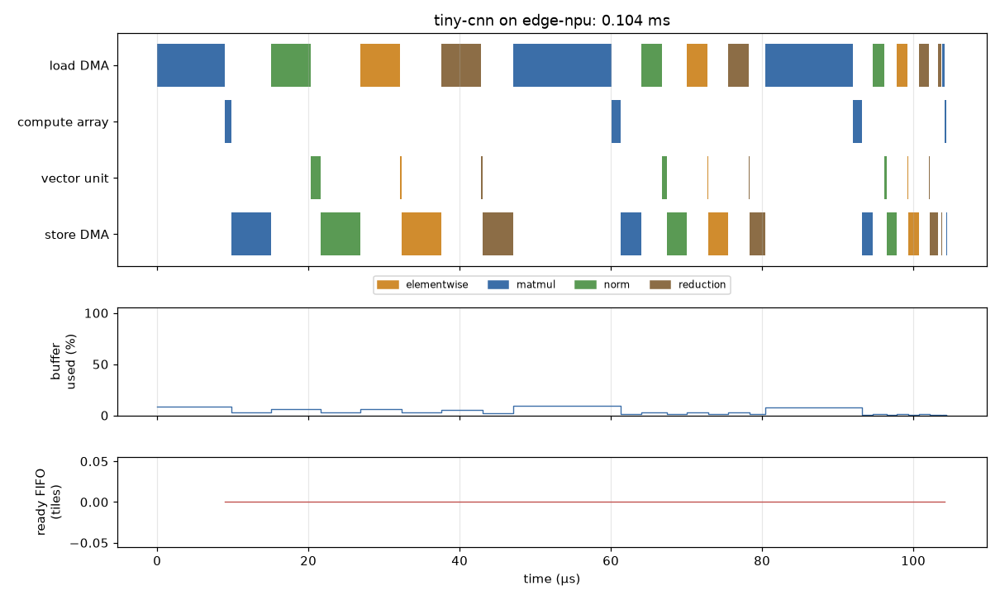

# simfront.accel: results

Generated by `examples/accel_results.py`; do not edit. Accelerator parameters are the illustrative presets in `src/simfront/accel/hw.py`.

## 1. Environment

| Item | Value |
|---|---|
| CPU | Intel(R) Core(TM) i7-3770 CPU @ 3.40GHz |
| Python | 3.12.12 |
| SimPy | 4.1.2 |
| PyTorch | 2.14.1+cpu |
| onnx | 1.23.1 |
| pybind11 (built with) | 3.1.0 |
| C++ standard (__cplusplus) | 202002 |
| C++ compiler | g++ (Ubuntu 13.3.0-6ubuntu2~24.04.1) 13.3.0 |
| C++ fast path built | yes |

| Preset | Array | Peak (TFLOP/s) | Vector lanes | Buffer | DRAM (GB/s, channels) | NoC (GB/s) |
|---|---|---|---|---|---|---|
| edge-npu | 32x32 | 2.0 | 64 | 2 MiB | 25.6 x2 | 64 |
| dc-npu | 128x128 | 32.8 | 512 | 32 MiB | 1,600.0 x8 | 512 |

## 2. A bounded FIFO: back-pressure and Little's law

A producer and a consumer joined by `simpy.Store(capacity=depth)`, 2,000 items, service times uniform in mean x (1 ± 0.5). *Slow consumer*: producer mean 1.0, consumer mean 1.2. *Bursty*: both mean 1.0, the producer emits bursts of 8. L is the time-averaged depth; λW is throughput x mean time in the FIFO.
| Case | Depth | Throughput (items/unit) | Producer blocked | Consumer starved | L | λW | Max depth |
|---|---|---|---|---|---|---|---|
| slow consumer | 1 | 0.8271 | 17.0% | 0.6% | 0.809 | 0.809 | 1 |
| slow consumer | 2 | 0.8308 | 16.6% | 0.1% | 1.761 | 1.761 | 2 |
| slow consumer | 4 | 0.8317 | 16.4% | 0.0% | 3.709 | 3.709 | 4 |
| slow consumer | 8 | 0.8317 | 16.2% | 0.0% | 7.641 | 7.641 | 8 |
| slow consumer | 16 | 0.8317 | 15.9% | 0.0% | 15.373 | 15.373 | 16 |
| bursty | 1 | 0.5741 | 42.9% | 42.5% | 0.503 | 0.503 | 1 |
| bursty | 2 | 0.6181 | 38.5% | 38.1% | 1.003 | 1.003 | 2 |
| bursty | 4 | 0.7219 | 28.1% | 27.7% | 2.021 | 2.021 | 4 |
| bursty | 8 | 0.9054 | 9.6% | 9.3% | 4.208 | 4.208 | 8 |
| bursty | 16 | 0.9641 | 3.4% | 3.4% | 7.805 | 7.805 | 16 |

## 3. A convolution network through the accelerator, from torch.export and from ONNX

| Route | Trace operators | Simulated operators | Tiles | Array MACs | Latency (µs) | Array busy | PE efficiency | DRAM bandwidth used | Hot-spot |
|---|---|---|---|---|---|---|---|---|---|
| export | 15 | 14 | 14 | 2,802,304 | 104.44 | 3.3% | 78.5% | 45.2% | off-chip memory |
| onnx | 17 | 14 | 14 | 2,802,304 | 99.96 | 3.5% | 78.5% | 45.0% | off-chip memory |

The full report for the torch.export route (`simfront-accel --model tiny-cnn`):

**tiny-cnn on edge-npu** (simpy): 0.1044 ms, 14 tiles, 14 operators

| Component | Busy | Bytes | Bandwidth used |
|---|---|---|---|
| off-chip memory | 46.8% | 1.21 MB | 45.2% |
| NoC read | 59.8% | 0.78 MB | 11.6% |
| NoC write | 33.8% | 0.43 MB | 6.4% |
| load DMA | 59.8% | 0.78 MB | — |
| store DMA | 33.8% | 0.43 MB | — |
| compute array | 3.3% (PE efficiency 78.5%) | — | — |
| vector unit | 3.0% | — | — |
| on-chip buffer | 5.1% mean occupancy (peak 9.5%) | — | — |

| Where the compute units' time went | Share |
|---|---|
| compute | 6.4% |
| load bandwidth | 59.8% |
| buffer full | 0.0% |
| dependency | 33.7% |
| store tail | 0.1% |

**Hot-spot: off-chip memory.** Compute waits 59.8% of the run for operand loads; one transfer runs at 12.8 GB/s, set by the memory channel.

| Top operators by time | Category | Unit | Time (µs) | Share | Bound |
|---|---|---|---|---|---|
| aten.convolution #4 | matmul | array | 16.98 | 16.3% | memory |
| aten.convolution #0 | matmul | array | 15.06 | 14.4% | memory |
| aten.convolution #8 | matmul | array | 14.26 | 13.7% | memory |
| aten._native_batch_norm_legit_no_training #1 | norm | vector | 11.78 | 11.3% | memory |
| aten.relu #2 | elementwise | vector | 10.74 | 10.3% | memory |
| aten.max_pool2d_with_indices #3 | reduction | vector | 9.46 | 9.1% | memory |

Operator latency histogram (log bins):

| From (µs) | To (µs) | Operators |
|---|---|---|
| 0.59 | 1.03 | 2 |
| 1.03 | 1.81 | 0 |
| 1.81 | 3.17 | 2 |
| 3.17 | 5.54 | 3 |
| 5.54 | 9.70 | 2 |
| 9.70 | 16.98 | 5 |

**Finding the stalls: a sweep** (fast path; batch 8 images so the convolutions are worth tiling):

| Buffer | DRAM GB/s | Array | Tiles | Latency (µs) | Computing | Load bandwidth | Buffer full | Dependency | Hot-spot |
|---|---|---|---|---|---|---|---|---|---|
| 128 KiB | 12.8 | 32x32 | 184 | 1,083.33 | 5.2% | 90.1% | 0.0% | 4.6% | off-chip memory |
| 128 KiB | 12.8 | 64x64 | 184 | 1,083.11 | 4.4% | 90.9% | 0.0% | 4.6% | off-chip memory |
| 128 KiB | 25.6 | 32x32 | 184 | 560.16 | 10.1% | 85.2% | 0.0% | 4.6% | off-chip memory |
| 128 KiB | 25.6 | 64x64 | 184 | 559.95 | 8.6% | 86.8% | 0.0% | 4.6% | off-chip memory |
| 128 KiB | 102.4 | 32x32 | 184 | 167.78 | 33.9% | 61.5% | 0.0% | 4.6% | off-chip memory |
| 128 KiB | 102.4 | 64x64 | 184 | 167.57 | 28.7% | 66.7% | 0.0% | 4.6% | off-chip memory |
| 512 KiB | 12.8 | 32x32 | 46 | 1,097.59 | 4.7% | 79.3% | 0.0% | 16.0% | off-chip memory |
| 512 KiB | 12.8 | 64x64 | 46 | 1,095.11 | 3.5% | 80.5% | 0.0% | 16.0% | off-chip memory |
| 512 KiB | 25.6 | 32x32 | 46 | 561.14 | 9.3% | 75.0% | 0.0% | 15.8% | off-chip memory |
| 512 KiB | 25.6 | 64x64 | 46 | 558.66 | 6.9% | 77.3% | 0.0% | 15.8% | off-chip memory |
| 512 KiB | 102.4 | 32x32 | 46 | 158.84 | 32.7% | 52.6% | 0.0% | 14.7% | off-chip memory |
| 512 KiB | 102.4 | 64x64 | 46 | 156.32 | 24.5% | 60.5% | 0.0% | 14.9% | off-chip memory |
| 2048 KiB | 12.8 | 32x32 | 17 | 1,345.73 | 3.8% | 63.7% | 0.0% | 32.5% | off-chip memory |
| 2048 KiB | 12.8 | 64x64 | 17 | 1,335.04 | 2.7% | 64.5% | 0.0% | 32.7% | off-chip memory |
| 2048 KiB | 25.6 | 32x32 | 17 | 693.57 | 7.4% | 61.0% | 0.0% | 31.6% | off-chip memory |
| 2048 KiB | 25.6 | 64x64 | 17 | 682.88 | 5.3% | 62.5% | 0.0% | 32.1% | off-chip memory |
| 2048 KiB | 102.4 | 32x32 | 17 | 204.45 | 24.9% | 47.6% | 0.0% | 27.4% | off-chip memory |
| 2048 KiB | 102.4 | 64x64 | 17 | 193.77 | 18.8% | 52.2% | 0.0% | 28.9% | off-chip memory |

## 4. A real model configuration: GPT-2 and Llama-3-8B prefill (meta device, no weights)

| Model | Route | Tokens | Preset | Operators | Tiles | Latency (ms) | Array TFLOP/s achieved | Array busy | DRAM bandwidth used | Traffic / operator bytes | Hot-spot |
|---|---|---|---|---|---|---|---|---|---|---|---|
| gpt2 | export | 128 | edge-npu | 815 | 1,051 | 51.837 | 0.62 | 31.0% | 56.4% | 1.09 | off-chip memory |
| gpt2 | export | 128 | dc-npu | 815 | 463 | 4.212 | 7.65 | 24.2% | 10.2% | 1.00 | off-chip memory |
| llama3-8b | dispatch | 2048 | dc-npu | 3557 | 17,991 | 1,613.057 | 20.42 | 62.5% | 9.4% | 1.13 | compute array |

GPT-2, 128-token prefill on `edge-npu`:

**gpt2 on edge-npu** (c++): 51.8373 ms, 1,051 tiles, 456 operators

| Component | Busy | Bytes | Bandwidth used |
|---|---|---|---|
| off-chip memory | 56.6% | 748.23 MB | 56.4% |
| NoC read | 82.1% | 542.94 MB | 16.4% |
| NoC write | 31.2% | 205.29 MB | 6.2% |
| load DMA | 82.1% | 542.94 MB | — |
| store DMA | 31.2% | 205.29 MB | — |
| compute array | 31.0% (PE efficiency 98.1%) | — | — |
| vector unit | 2.6% | — | — |
| on-chip buffer | 50.6% mean occupancy (peak 93.8%) | — | — |

| Where the compute units' time went | Share |
|---|---|
| compute | 33.6% |
| load bandwidth | 53.5% |
| buffer full | 0.0% |
| dependency | 12.9% |
| store tail | 0.0% |

**Hot-spot: off-chip memory.** Compute waits 53.5% of the run for operand loads; one transfer runs at 12.8 GB/s, set by the memory channel.

| Top operators by time | Category | Unit | Time (µs) | Share | Bound |
|---|---|---|---|---|---|
| aten.mm #813 | matmul | array | 8,053.18 | 15.5% | memory |
| aten.addmm #613 | matmul | array | 537.21 | 1.0% | memory |
| aten.addmm #666 | matmul | array | 537.21 | 1.0% | memory |
| aten.addmm #677 | matmul | array | 537.21 | 1.0% | memory |
| aten.addmm #730 | matmul | array | 537.21 | 1.0% | memory |
| aten.addmm #741 | matmul | array | 537.21 | 1.0% | memory |

## 5. Process-based (event-driven) against cycle-based (cycle-stepped)

The same quantised program (every duration rounded up to whole cycles at 1 GHz) on both engines. `Identical` compares every tile's eight event times.
| Program | Tiles | Cycles | SimPy events | Cycle-model evaluations | SimPy (s) | Cycle-stepped (s) | Slower by | Identical |
|---|---|---|---|---|---|---|---|---|
| tiny-cnn | 14 | 104,439 | 314 | 313,449 | 0.001 | 0.04 | 41x | yes |
| tiny-llama, 32 tokens | 139 | 973,135 | 2,999 | 2,920,647 | 0.009 | 0.27 | 31x | yes |
| gpt2, 128 tokens | 1051 | 51,837,348 | 20,775 | 155,520,753 | 0.059 | 13.83 | 233x | yes |

## 6. An FHE-style workload: polynomial products through the NTT

One RNS polynomial product, N = 2^16, 24 limbs (per limb: NTT a, NTT b, pointwise multiply, INTT; 8-byte words). An NTT is (N/2)·log2 N butterflies at 3 operations each, which is 3·log2 N / 16 = 3.0 operations per input byte at N = 2^16. *In transit* puts the NTT in a stage in the memory read path with the given budget in operations per byte (**speculative**; the budgets are illustrative). *Vector lanes* sets how fast the on-chip NTT is.
| Preset | Vector lanes | NTT runs | Latency (µs) | Speed-up | Vector unit busy | Hot-spot |
|---|---|---|---|---|---|---|
| edge-npu | 64 | on chip | 6,856.50 | 1.00x | 9.0% | off-chip memory |
| edge-npu | 64 | in transit, 0.5 | 21,208.89 | 0.32x | 0.1% | in-transit stage |
| edge-npu | 64 | in transit, 1.6 | 9,043.77 | 0.76x | 0.3% | in-transit stage |
| edge-npu | 64 | in transit, 3.0 | 6,463.29 | 1.06x | 0.4% | in-transit stage |
| edge-npu | 64 | in transit, 6.0 | 6,463.29 | 1.06x | 0.4% | in-transit stage |
| edge-npu | 8 | on chip | 9,719.49 | 1.00x | 50.6% | vector unit |
| edge-npu | 8 | in transit, 0.5 | 21,294.90 | 0.46x | 0.9% | in-transit stage |
| edge-npu | 8 | in transit, 1.6 | 9,129.78 | 1.06x | 2.2% | in-transit stage |
| edge-npu | 8 | in transit, 3.0 | 6,549.30 | 1.48x | 3.0% | in-transit stage |
| edge-npu | 8 | in transit, 6.0 | 6,549.30 | 1.48x | 3.0% | in-transit stage |
| dc-npu | 512 | on chip | 489.10 | 1.00x | 15.7% | off-chip memory |
| dc-npu | 512 | in transit, 0.5 | 1,407.21 | 0.35x | 0.2% | in-transit stage |
| dc-npu | 512 | in transit, 1.6 | 628.65 | 0.78x | 0.5% | in-transit stage |
| dc-npu | 512 | in transit, 3.0 | 463.50 | 1.06x | 0.7% | in-transit stage |
| dc-npu | 512 | in transit, 6.0 | 463.50 | 1.06x | 0.7% | in-transit stage |
| dc-npu | 16 | on chip | 2,789.18 | 1.00x | 88.1% | vector unit |
| dc-npu | 16 | in transit, 0.5 | 1,502.45 | 1.86x | 6.5% | in-transit stage |
| dc-npu | 16 | in transit, 1.6 | 723.88 | 3.85x | 13.6% | in-transit stage |
| dc-npu | 16 | in transit, 3.0 | 558.73 | 4.99x | 17.6% | in-transit stage |
| dc-npu | 16 | in transit, 6.0 | 558.73 | 4.99x | 17.6% | in-transit stage |

## 7. The hot path in C++: SimPy, the Python recurrence and the pybind11 module

Wall-clock seconds, best of 3 (SimPy: best of 2 for the largest program). *C++ kernel* is `Pipeline.run()` alone; *C++ call* adds building the columns in Python and converting them (what `fastpath.run` costs). *Lowering* (trace to tiles, Python) is shown because it bounds the end-to-end gain. Every engine's timings were checked identical to SimPy's.
| Program | Tiles | SimPy (s) | Python recurrence (s) | C++ call (s) | C++ kernel (s) | Recurrence vs SimPy | C++ call vs Python | C++ kernel vs Python | Identical |
|---|---|---|---|---|---|---|---|---|---|
| tiny-cnn (edge-npu) | 14 | 0.001 | 0.0000 | 0.0000 | 0.00000 | 31x | 1.7x | 12x | yes |
| gpt2 128 (edge-npu) | 1,051 | 0.061 | 0.0019 | 0.0009 | 0.00013 | 32x | 2.2x | 15x | yes |
| llama3-8b 2048 (dc-npu) | 17,991 | 0.996 | 0.0372 | 0.0194 | 0.00287 | 27x | 1.9x | 13x | yes |
| llama3-8b 512 (edge-npu) | 87,075 | 3.728 | 0.1727 | 0.0991 | 0.01592 | 22x | 1.7x | 11x | yes |

| Program | Lowering, Python (s) |
|---|---|
| gpt2 128 (edge-npu) | 0.0068 |
| llama3-8b 2048 (dc-npu) | 0.0747 |
| llama3-8b 512 (edge-npu) | 0.2562 |

## 8. Execution providers: what ONNX Runtime ran, and a simulated device's share

ONNX Runtime, the tiny CNN with weights, graph optimisations off, profiling on. Nodes per provider, read from the profile:

| Provider | Nodes | Operator types |
|---|---|---|
| CPUExecutionProvider | 15 | BatchNormalization, Conv, Gemm, MaxPool, ReduceMean, Relu, Reshape |

The same graph partitioned by `simfront.accel.ep.claim` for a device that supports the listed operator types, and costed with `ep.simulate` (device: `edge-npu`; host: the illustrative host CPU roofline; link 64 GB/s, 1 µs per transfer):

| Device supports | Nodes claimed | Subgraphs | Crossings | Crossing kB | Device (µs) | Host (µs) | Link (µs) | Total (µs) |
|---|---|---|---|---|---|---|---|---|
| Conv, Gemm | 4/17 | 4 | 13 | 140.4 | 36.35 | 3.04 | 15.19 | 54.59 |
| + Relu, MaxPool | 10/17 | 5 | 12 | 230.3 | 69.17 | 1.16 | 15.60 | 85.93 |
| + BatchNormalization, ReduceMean (everything) | 17/17 | 1 | 0 | 0.0 | 99.96 | 0.00 | 0.00 | 99.96 |

